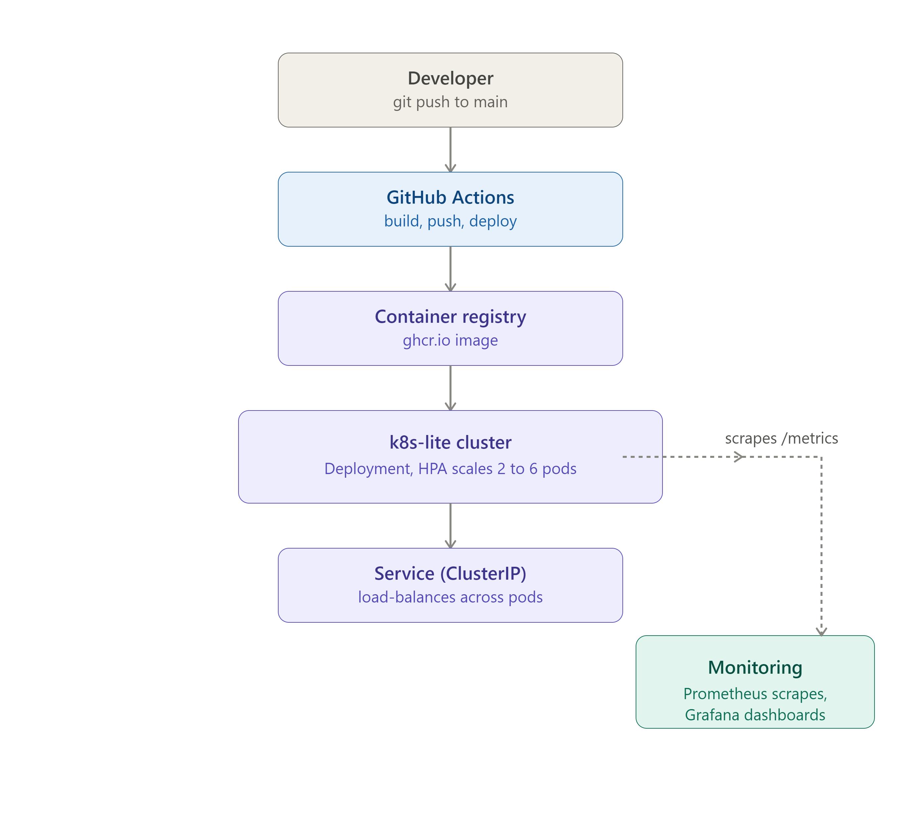

# Kubernetes-Lite Deploy

## Problem
Scaling microservices is hard without a consistent deploy/scale workflow.

## What this demonstrates
- Deploying a small containerized service to AKS
- Manifests (Deployment, Service, ConfigMap, HPA)
- Manual + autoscaled scaling
- In-cluster observability via Prometheus/Grafana

## Architecture
See 

## Cost-safety measures
- AKS free control-plane tier, single Standard_B2s node
- Cluster only runs during demo recording (see scripts/)
- Budget alert set at $5 in Azure Cost Management
- `scripts/cluster-down.sh` destroys everything via Terraform when done

## How to reproduce
\`\`\`bash
git clone <this-repo>
cd k8s-lite-deploy
./scripts/cluster-up.sh
./scripts/deploy.sh
# demo steps...
./scripts/cluster-down.sh
\`\`\`

## 📺 Video Demonstrations

### YouTube

### Thumbnail

### Download
<a href="https://www.youtube.com/watch?v=BhGmuqFY8gs" download>
  <button>Download Video</button>
</a>
